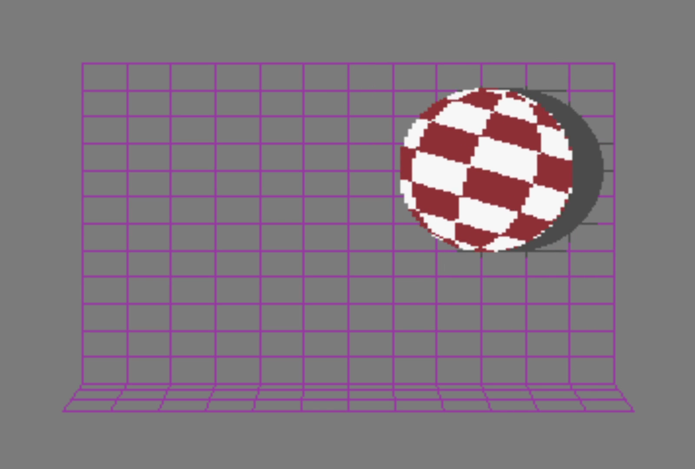

# Boing ball out of multiplexed hardware sprites



The Amiga Boing Ball recreated on a C64: a rotating red-and-white ball,
perspective grid, moving shadow, and PCM boing on every bounce.

## The effect

- **Ball:** eight VIC-II sprites are multiplexed into two columns by four rows.
  Each position overlaps a white sprite and a red sprite, so one frame uses 16
  sprite placements. Sixteen generated rotation frames keep it spinning.
- **Scene:** a custom hires bitmap supplies the grey field, purple wall grid,
  and perspective floor.
- **Shadow:** a software-composited vsprite, similar to an Amiga blitter object
  but drawn by the 6510 without a blitter. The clean bitmap lives in the REU;
  each frame restores the old shadow and draws the new one.
- **Sound:** signed 8-bit PCM is stored in the REU and played through Ultimate
  Audio on channel 0. A bounce restarts the sample from the beginning.

## SDK code versus demo code

The PRG embeds the SDK's standalone blob at `$8000` and uses these entry
points:

| SDK API | Used for |
|---|---|
| `ultimate_init` | Require a working Ultimate Command Interface |
| `ultimate_turbo_available`, `ultimate_turbo_set`, `ultimate_turbo_badlines` | Select maximum CPU speed and disable VIC badline stalls |
| `ultimate_reu_available`, `ultimate_reu_stash`, `ultimate_reu_fetch` | Store the clean bitmap and PCM sample, then restore the shadow area |
| `ultimate_audio_init`, `ultimate_audio_configure`, `ultimate_audio_start`, `ultimate_audio_stop` | Configure and retrigger the PCM voice safely |
| `ultimate_vsprite_draw` | Composite and recolor the moving shadow |

The rendering and movement are custom demo code: the raster multiplexer,
sprite construction, rotation data, bounce physics, bitmap and grid generation,
shadow positioning and image shifting, and audio voice setup. The generators
are `genball.py`, `genbg.py`, and `mkpcm.py`; the runtime is `boing.asm`.

## Run it

`boing.prg` is self-contained: program, graphics, SDK blob, and sound are all
inside it. Copy that file to USB or Ultimate storage and choose **Run** in the
Ultimate file browser. A D64 is unnecessary.

Required Ultimate settings:

- **Command Interface:** Enabled
- **Turbo Control:** U64 Turbo Registers

The demo returns to BASIC if UCI or turbo is unavailable. For the complete
effect, also enable:

- **RAM Expansion Unit:** Enabled
- **Map Ultimate Audio `$DF20-DFFF`:** Enabled

Without the REU there is no shadow or sound. Without mapped Ultimate Audio
there is no sound.

## Build and verify

From the repository root:

```sh
make boing
make -C demos/boing check
make boing-run U64_HOST=192.168.1.62
```

`make boing` rebuilds the self-contained PRG. A clean rebuild needs
KickAssembler, Python 3, and Pillow. If `boing-orig8.pcm` is present locally,
the build uses it at 8,363 Hz; otherwise it generates the synthetic fallback.

`make -C demos/boing check` verifies startup refusal without UCI and checks the
graphics and motion in VICE. `make boing-run` uploads through the Ultimate's
FTP-backed `/Temp` storage, runs the demo, and verifies startup, `$D031=$8F`,
SDK feature flags, frame rate, and bounce progress on real hardware.
